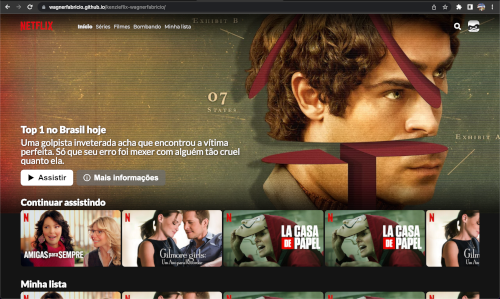

# CloneFlix - Just a copy of a famous video streamer!

Responsive and built only in JavaScript, HTML5 and CSS3, a copy of the layout of a very famous video streamer company. 

GitHub Pages link: [https://wagnerfabricio.github.io/kenzieflix-wagnerfabricio/](https://wagnerfabricio.github.io/kenzieflix-wagnerfabricio/)

<td valign="top" width="33%">

## Images:

</td>

<td valign="top" width="33%">

### Techs:

</td>
